# Software Design Description

## Introduction

The **SG Routing App** lets a user **plan a route and visualise it on an interactive map**, while also exploring **road-type overlays** and managing **routing blockages**.

The current scope focuses on a **Vite + React frontend** talking to hosted routing services (returning route and overlay data as **GeoJSON**):

* Checking backend readiness and showing a clear status (**Ready / Warming up / Error**).
* Defining start/end points via:

  * typed latitude/longitude, or
  * map-picking (click on map to set a point).
* Requesting the **shortest route** from the backend and rendering it as a GeoJSON route line on the map.
* Improving usability with:

  * replacing the previous route on each new search,
  * reversing start/end points for quick opposite-direction planning,
  * automatic map focus on the searched route or selected blockage (inset-aware when the sidebar is expanded),
  * hover tooltips for route segments (road name + type) and markers (latitude + longitude),
  * a transport mode selector (car/cycle/walk) that updates valid road types for routing,
  * a road-type overlay tab to toggle road layers,
  * blockage management (view/add/delete/focus),
  * a **simple vs default basemap** toggle, and
  * a collapsible sidebar (Google Maps-style rail).

On the frontend, the main logic lives in:

* `App.jsx` – **overall state + orchestration**, including:

  * server readiness polling,
  * tab selection, sidebar collapse state, busy/loading states,
  * start/end inputs and selection mode,
  * route search/reverse and reroute triggers on blockage changes,
  * road-type selection and valid-road-types updates.
* `MapView.jsx` – **Leaflet map component** that:

  * renders the basemap (default or simple),
  * draws the route GeoJSON,
  * draws road-type overlay GeoJSON layers,
  * draws blockages and blockage radii,
  * renders start/end markers (and nearest-on-route markers),
  * provides hover tooltips for route/markers,
  * automatically fits/centres the map for route and blockage focus, **taking sidebar inset into account**.
* `RouteTab.jsx`, `RoadTypesTab.jsx`, `BlockagesTab.jsx` – sidebar tab UIs for route input/actions, overlay selection, and blockage management.

---

## Summary of User Story to Sequence Diagram Mapping

| No. | User Story                         | Sequence Diagram Focus                                                           |
| --- | ---------------------------------- | -------------------------------------------------------------------------------- |
| 1   | Check Server Readiness             | How the status badge and refresh call `/ready`                                   |
| 2   | Define Start and End Points        | How typed inputs and map-picking set start/end state                             |
| 3   | Search for Route                   | How `App` calls `POST /route` and renders the returned GeoJSON                   |
| 4   | View Route on Map                  | How GeoJSON becomes a Leaflet route layer                                        |
| 5   | View Route Details                 | How hover tooltips are derived from `feature.properties` and marker coords       |
| 6   | Replace Previous Route             | How route state and layers are cleared before rendering a new route              |
| 7   | Reverse Route                      | How swapping start/end updates state and enables re-search                       |
| 8   | Automatic Map Focus                | How `fitBounds` / `setView` are applied, including sidebar inset-aware behaviour |
| 9   | Select Transport Mode              | How switching mode updates valid road types (via `/changeValidRoadTypes`)        |
| 10  | View Road Types Overlay            | How toggled road-type GeoJSON is fetched and rendered                            |
| 11  | Manage Blockages                   | How blockages are fetched/added/deleted and trigger reroute + focus              |
| 12  | Toggle Simple Map Style            | How basemap tile URL changes without clearing overlays                           |
| 13  | Collapse / Expand Sidebar          | How sidebar state changes layout and affects map centring                        |

---

## Sequence Diagrams

The following diagrams show how the **user**, the **React application (`App` + `MapView`)**, and the **Routing APIs** collaborate to implement each feature.

For brevity, `App` represents the main React component (`App.jsx`), `MapView` represents the Leaflet map component (`MapView.jsx`), and `RoutingAPI` represents the backend endpoints used (e.g., `/ready`, `/route`, `/blockage`, `/axisType/...`).

---

### 1. Check Server Readiness

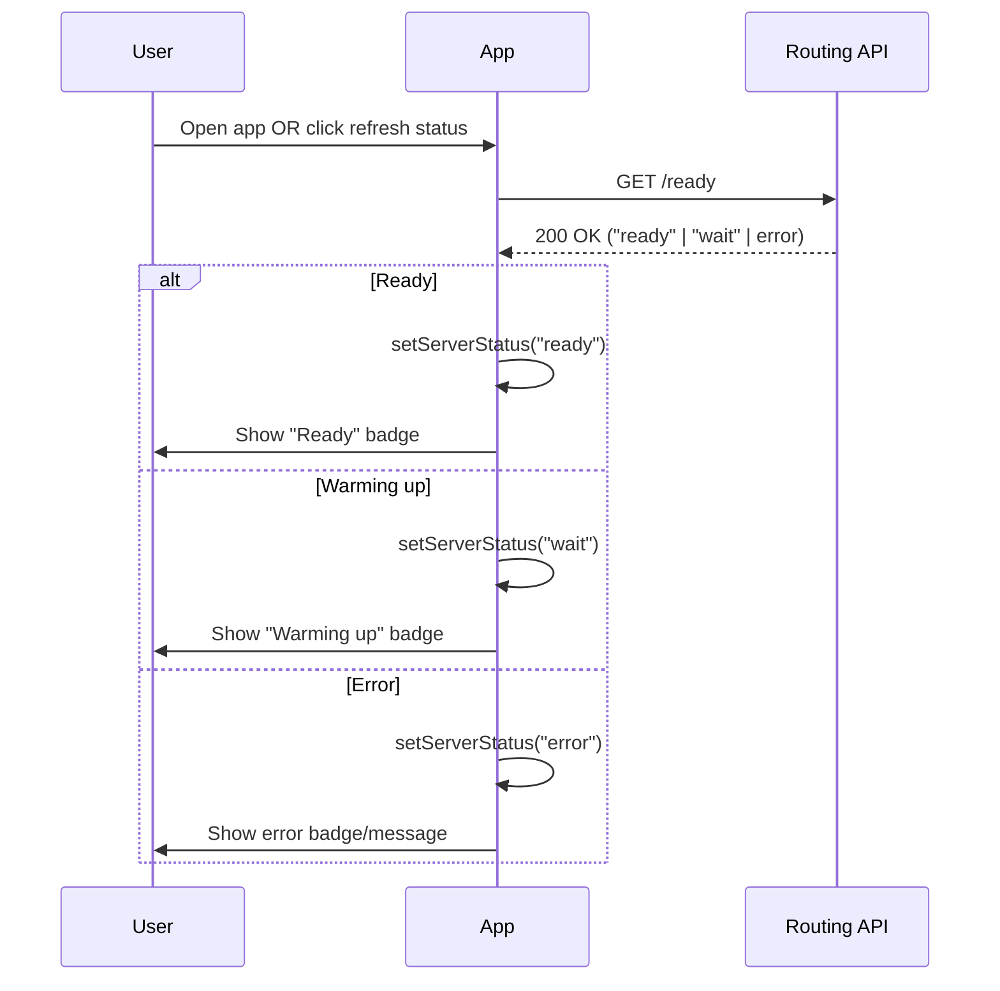

**Explanation:**
The app polls or the user refreshes `/ready`. The status badge informs the user of the server status.

---

### 2. Define Start and End Points

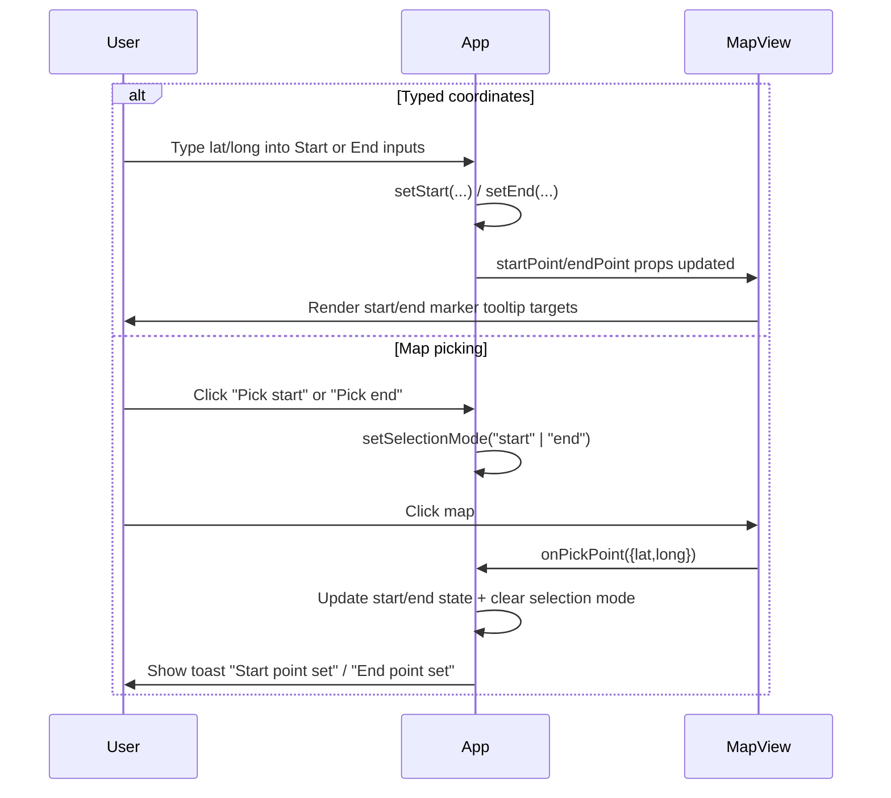

**Explanation:**
Start/end can be set by input fields or map click selection. Markers update on the map and tooltips are available on hover.

---

### 3. Search for Route

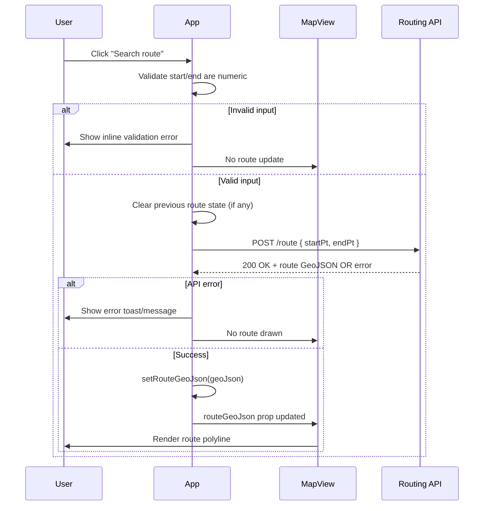

**Explanation:**
`App` validates input, calls `POST /route`, and updates `MapView` with the returned GeoJSON.

---

### 4. View Route on Map

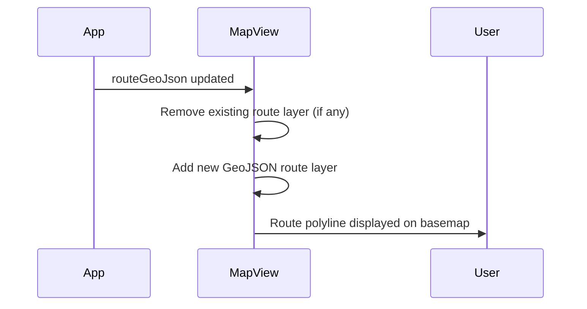

**Explanation:**
`MapView` replaces the Leaflet route layer whenever the route GeoJSON changes.

---

### 5. View Route Details

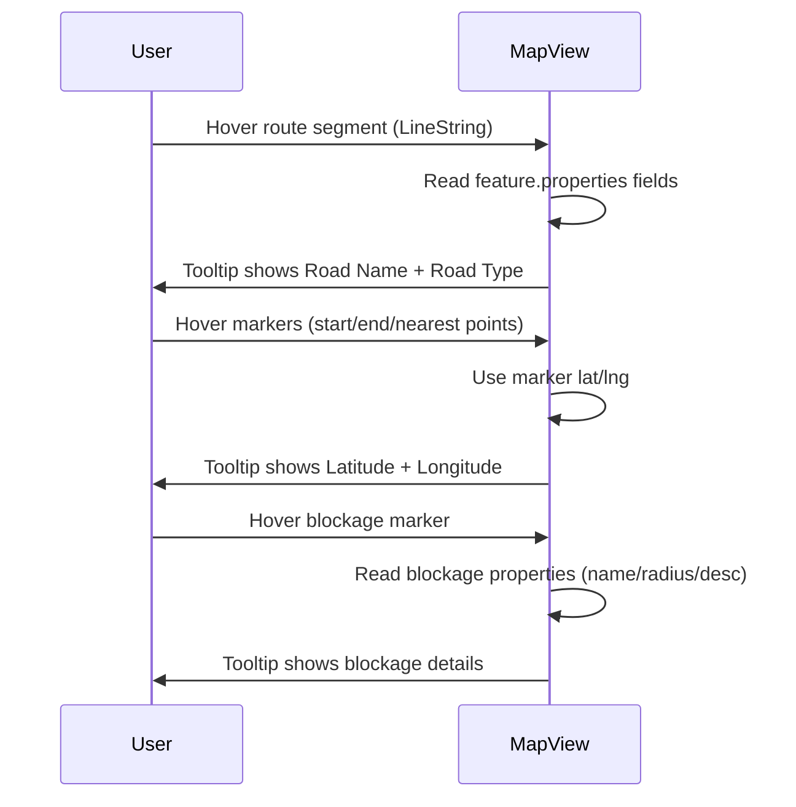

**Explanation:**
Tooltips come from GeoJSON properties (for route segments and blockages) and from marker coordinates (for points).

---

### 6. Replace Previous Route

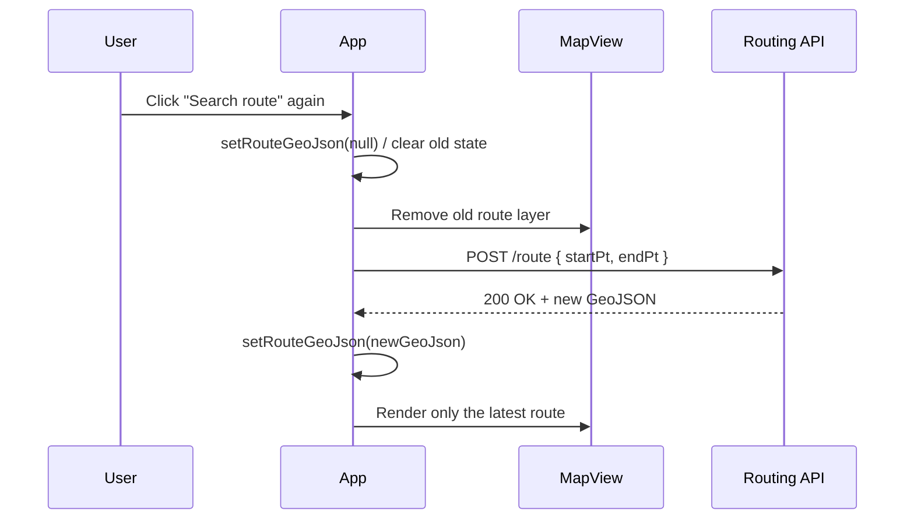

**Explanation:**
Only one route is shown at any time. Starting a new search clears the previous route before drawing the new one.

---

### 7. Reverse Route

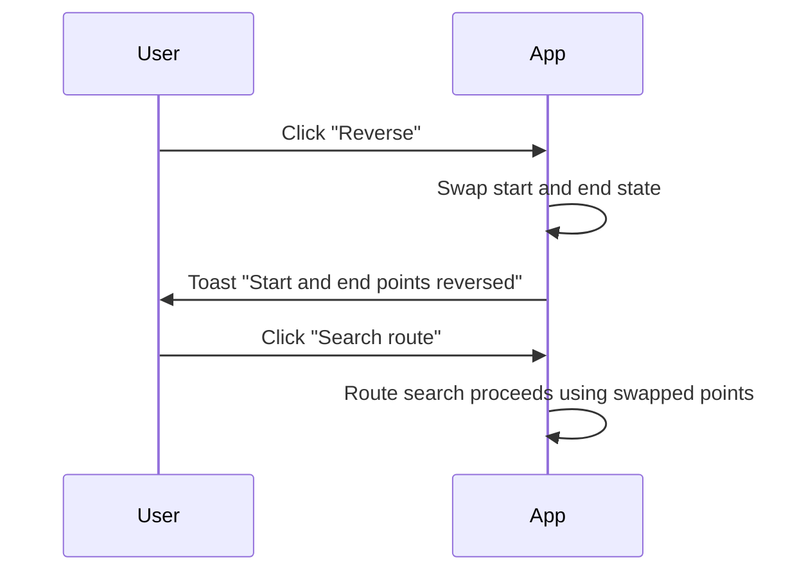

**Explanation:**
Reverse swaps start/end values. The user can immediately search again to get the opposite direction.

---

### 8. Automatic Map Focus

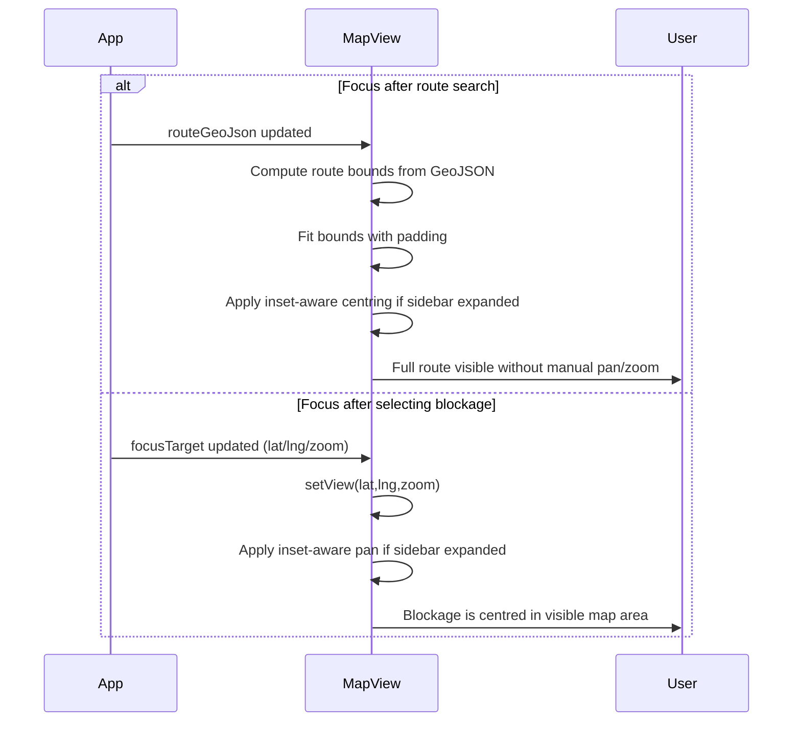

**Explanation:**
The map auto-focuses for both route results and blockage selection. When the sidebar is expanded, the focus is adjusted so the target does not sit under the sidebar.

---

### 9. Select Transport Mode

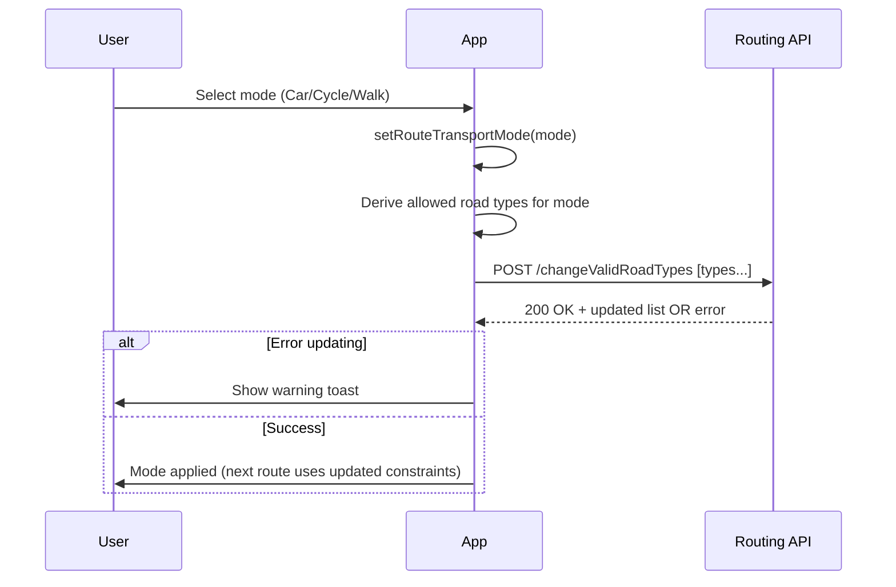

**Explanation:**
Changing transport mode updates which road types the backend uses for routing.

---

### 10. View Road Types Overlay

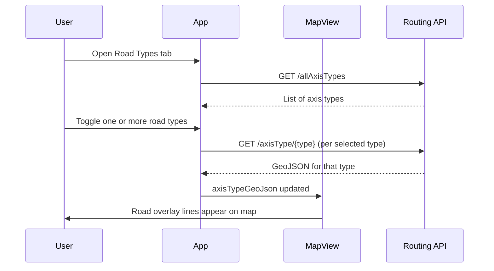

**Explanation:**
Road-type overlays are rendered as Leaflet GeoJSON layers and can be toggled without affecting the route.

---

### 11. Manage Blockages

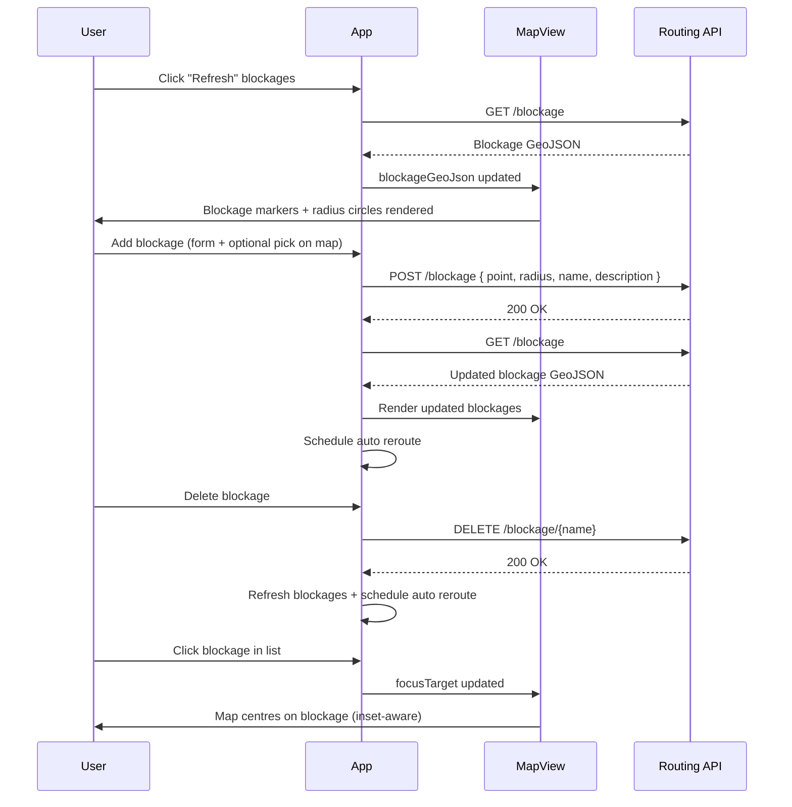

**Explanation:**
Blockages can be refreshed, added, deleted, and focused. Adding/deleting triggers rerouting behaviour in the app and refreshes the overlays.

---

### 12. Toggle Simple Map Style

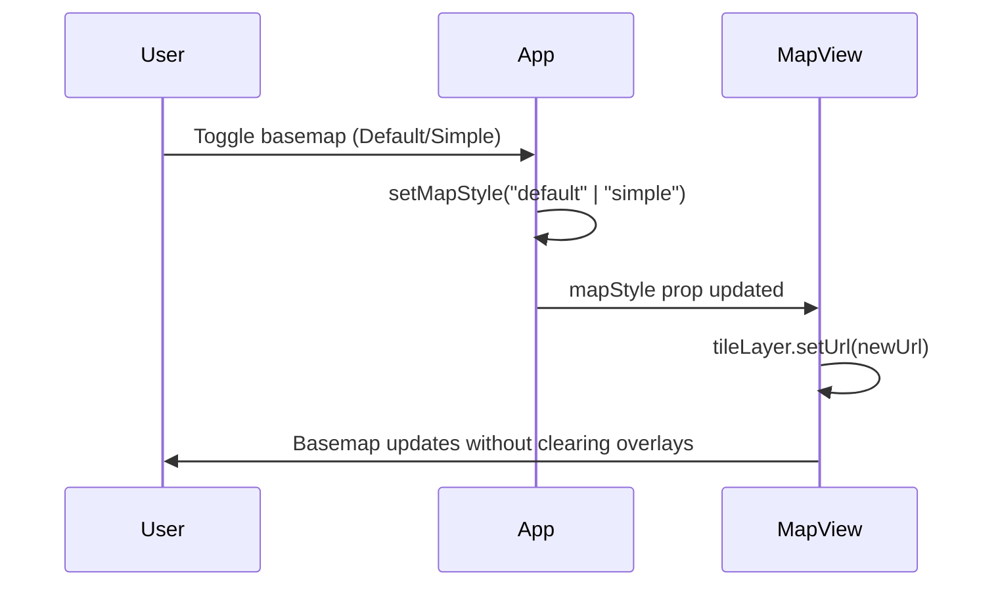

**Explanation:**
Basemap style toggles by swapping tile URLs. Route, blockages, and overlays remain intact.

---

### 13. Collapse / Expand Sidebar

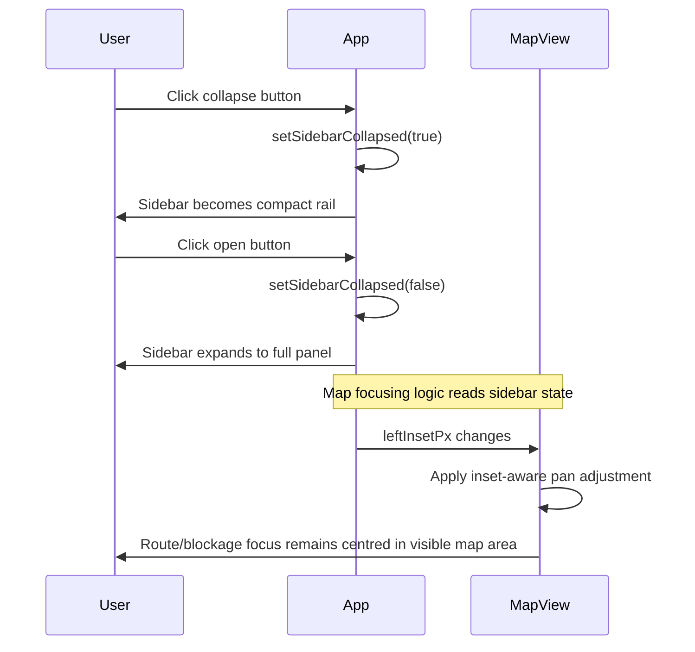

**Explanation:**
The sidebar can collapse and expand. When it changes width, map focus logic uses the inset to keep important content centred in the visible region.
