# Test Procedures

Each test procedure corresponds to a user story (**1–14**) and validates its acceptance criteria.

## User Story Table

| No. | User Story                         | As a... | I want to...                                                                | So that...                                                   |
| --- | ---------------------------------- | ------- | --------------------------------------------------------------------------- | ------------------------------------------------------------ |
| 1   | Check Server Readiness             | user    | see whether the backend is warming up or ready, and refresh the status      | I know when routing and other features can be used           |
| 2   | Define Start and End Points        | user    | set start and end points by typing coordinates or picking on the map        | a route can be computed between two locations                |
| 3   | Search for Route                   | user    | request the shortest route between my start and end points                  | the best route can be displayed on the map                   |
| 4   | View Route on Map                  | user    | view the returned route on an interactive map                               | the path can be visualised clearly                           |
| 5   | View Route Details                 | user    | hover over route segments and points to see details                         | road and coordinate information can be understood easily     |
| 6   | Replace Previous Route             | user    | have the current route cleared and replaced when I search again             | only the latest route is shown and the map stays uncluttered |
| 7   | Reverse Route                      | user    | reverse (swap) the start and end points                                     | I can quickly plan the opposite direction                    |
| 8   | Automatic Map Focus                | user    | have the map automatically focus on the searched route or selected blockage | the relevant area is visible without manual panning/zooming  |
| 9   | Select Transport Mode              | user    | choose a transport mode (car/cycle/walk)                                    | the route uses suitable road types for my travel method      |
| 10  | View Road Types Overlay            | user    | toggle road-type layers on the map                                          | I can explore different road network types visually          |            |
| 11  | Manage Blockages                   | user    | view, add, delete, and focus on blockages                                   | routing can avoid blocked regions and testing is easier      |
| 12  | Toggle Simple Map Style            | user    | toggle between a normal and a simpler basemap                               | a more readable map view can be chosen when needed           |
| 13  | Collapse / Expand Sidebar          | user    | collapse the sidebar into a compact rail and reopen it                      | more map space is available when needed                      |

---

## Test for 1: Check Server Readiness

**Objective:**
Verify that the server status is displayed correctly and can be refreshed, and that server-dependent actions are disabled when not ready.

**Steps:**

1. Launch the SG Routing App.
2. Observe the status badge in the top bar.
3. Click the refresh status button/icon.
4. Simulate the server not being ready (e.g., no internet), then repeat steps 2–3.
5. While status is not **Ready**, attempt a server-dependent action (e.g., Search Route).

**Expected Results:**

* The status badge shows **Ready**, **Warming up**, or **Error** appropriately.
* Clicking refresh triggers a new readiness check and updates the badge.
* When not **Ready**, server-dependent actions will display an error.

  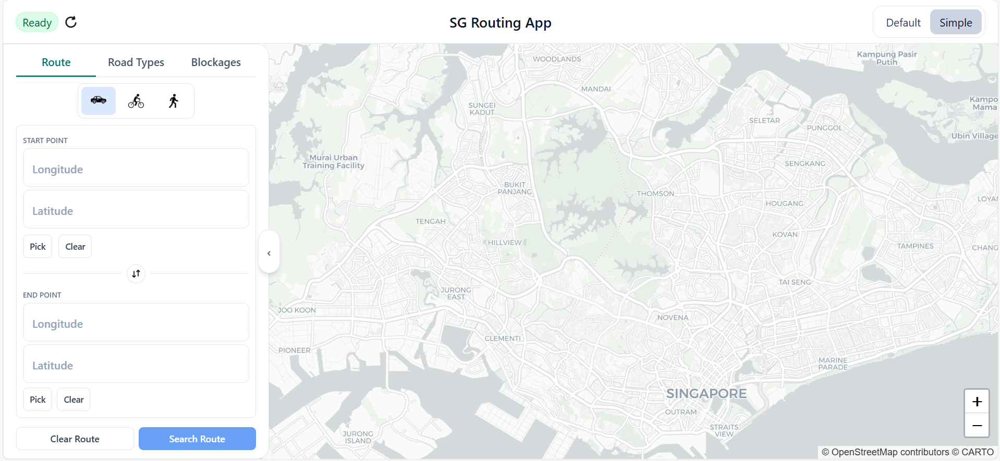
  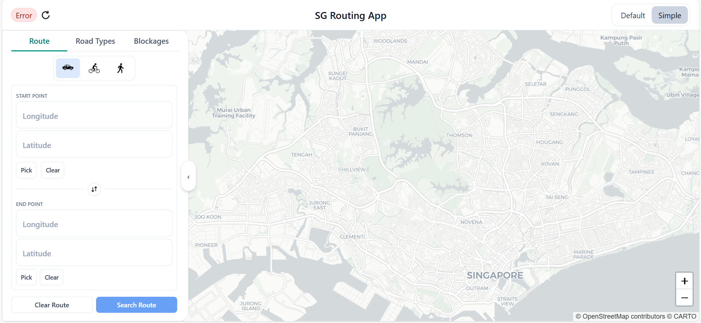

---

## Test for 2: Define Start and End Points

**Objective:**
Verify that start/end points can be set via typed coordinates and via map picking, and that markers/confirmation appear.

**Steps:**

1. Launch the app and go to the **Route** tab.
2. In **Start**, type a valid latitude/longitude pair.
3. In **End**, type a valid latitude/longitude pair.
4. Confirm that start/end markers appear on the map.
5. Click **Pick start**, then click a location on the map.
6. Click **Pick end**, then click a different location on the map.

**Expected Results:**

* Typed coordinates populate the fields and show start/end markers.
* When “Pick start/end” is active, the next map click sets the relevant point and exits pick mode.
* A confirmation toast/message appears (e.g., “Start point set.” / “End point set.”).

  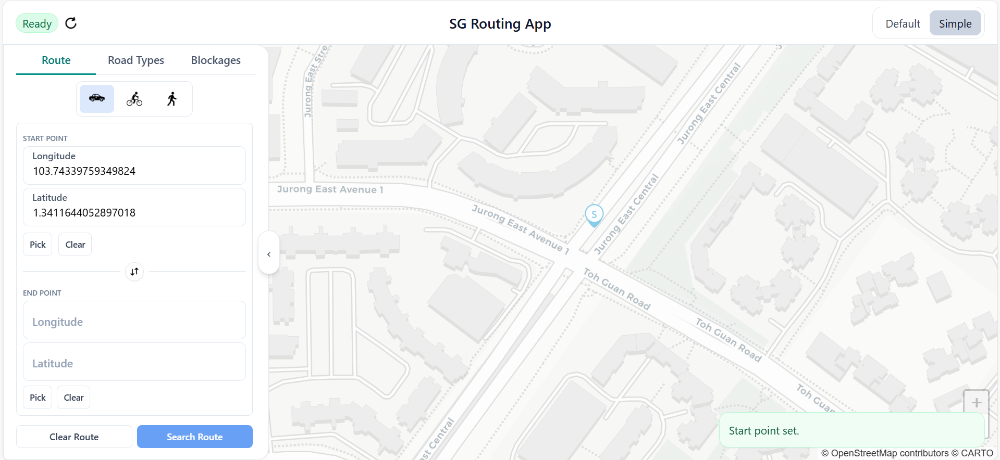

---

## Test for 3: Search for Route

**Objective:**
Verify that route search validates inputs, calls the backend when valid, and loads a GeoJSON route.

**Steps:**

1. Ensure server status is **Ready**.
2. In the **Route** tab, leave Start or End empty and click **Search Route**.
3. Enter a non-numeric value (e.g., `abc`) in a coordinate field and click **Search Route**.
4. Enter valid numeric Start and End coordinates and click **Search Route**.
5. Wait for the result to load.

**Expected Results:**

* For missing/invalid coordinates:

  * An inline validation error is shown.
  * No route request is sent (no new route is drawn).
* For valid coordinates:

  * The route request is sent to the backend.
  * The returned route is rendered as a polyline on the map.

  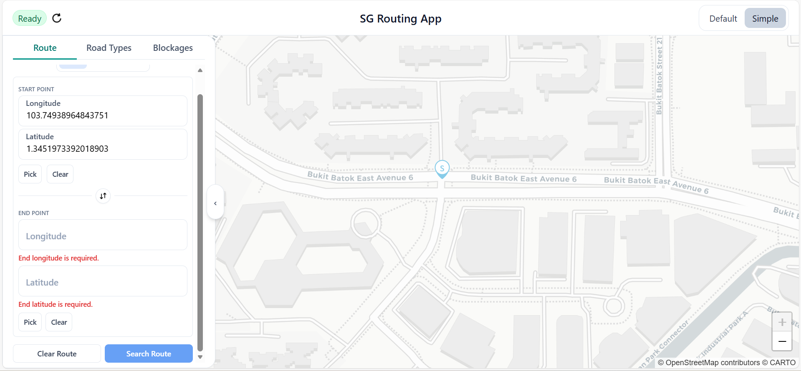
  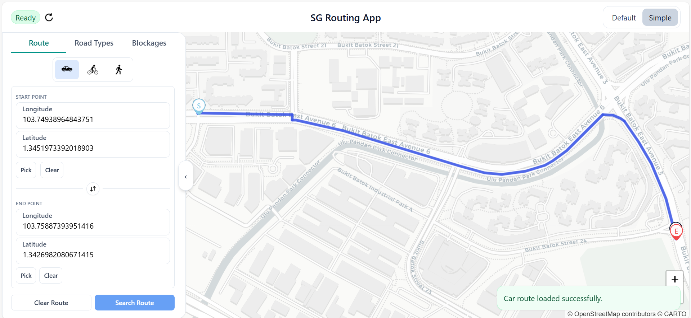

---

## Test for 4: View Route on Map

**Objective:**
Verify that a successfully returned route is visible on the map and that normal map interactions work.

**Steps:**

1. Perform a successful route search (User Story 3).
2. Pan the map by dragging.
3. Zoom in/out using the zoom controls.

**Expected Results:**

* The route polyline is visible after successful search.
* Zoom and pan work as expected.
* When no route is loaded, the map shows only the basemap (and any enabled overlays like road types/blockages) and an error message is displayed.

  

---

## Test for 5: View Route Details

**Objective:**
Verify hover tooltips for route segments (road name/type) and markers (lat/long), including blockage tooltips.

**Steps:**

1. Ensure a route is displayed on the map.
2. Hover over the route polyline.
3. Hover over the Start marker.
4. Hover over the End marker.
5. If nearest markers are displayed, hover over them too.
6. Hover over a blockage marker.

**Expected Results:**

* Hovering over a route segment shows a tooltip with:

  * **Road Name**
  * **Road Type**
* Hovering over a point marker shows a tooltip with:

  * **Latitude**
  * **Longitude**
* Hovering over a blockage shows  a tooltip with:
  * **Name**
  * **Radius**

* Tooltips disappear when the cursor moves away.

  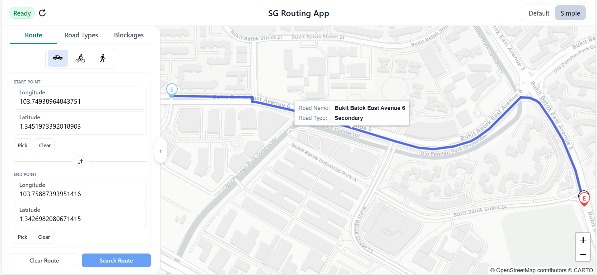
  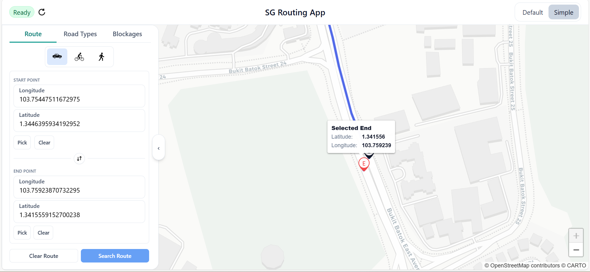
  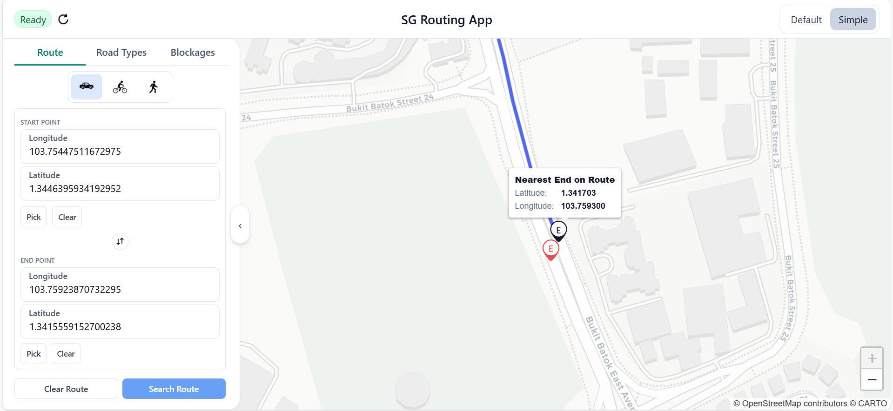

---

## Test for 6: Replace Previous Route

**Objective:**
Verify that searching again replaces the previous route so only the latest route remains.

**Steps:**

1. Search for **Route A** (Start A → End A) and wait for it to render.
2. Without refreshing the page, change coordinates to **Route B** (Start B → End B).
3. Click **Search Route** again.

**Expected Results:**

* When the second search starts, the previous route is cleared/replaced (no “double routes” remain).
* After Route B loads, only Route B is visible.
* No old route layers persist on the map.

---

## Test for 7: Reverse Route

**Objective:**
Verify that reversing swaps Start/End correctly and supports planning the opposite direction.

**Steps:**

1. Enter valid Start and End coordinates.
2. Click **Reverse**.
3. Confirm Start and End fields have swapped values.
4. Click **Search Route**.

**Expected Results:**

* Start and End coordinate values are swapped.
* The user can successfully search again using the swapped points.
* The displayed route changes accordingly (if the reverse produces a different path).

  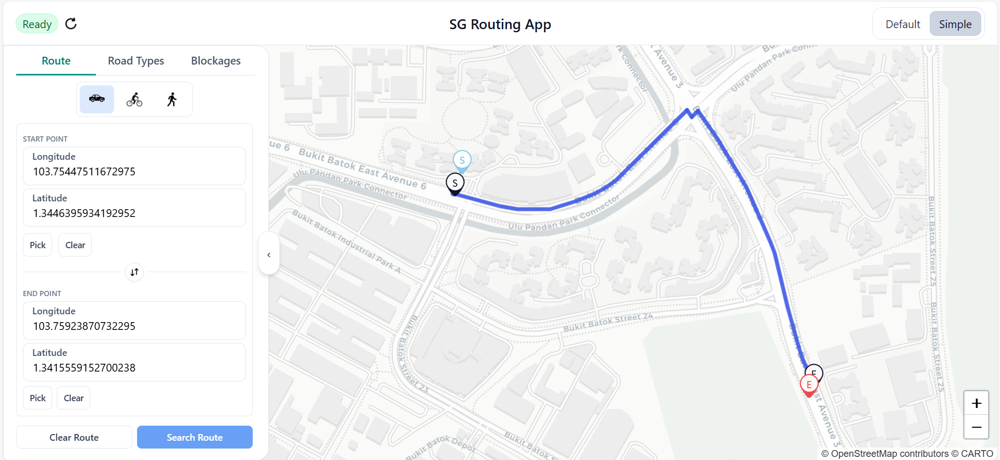
  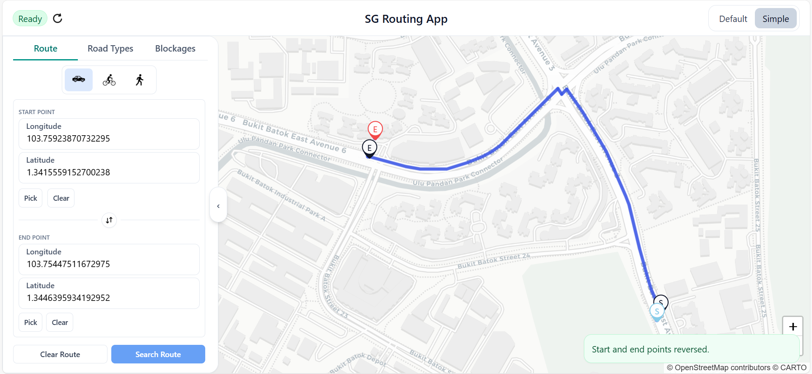

---

## Test for 8: Automatic Map Focus

**Objective:**
Verify the map auto-focuses on the searched route and on selected blockages.

**Steps:**

1. Expand the sidebar (not collapsed).
2. Search for a valid route and observe the map view after it loads.
3. Collapse the sidebar to the compact rail.
4. Go to **Blockages** tab and refresh blockages.
5. Click a blockage from the list to focus it.
6. Repeat step 5 once with sidebar expanded and once with sidebar collapsed.

**Expected Results:**

* After each successful route search, the map automatically adjusts to show the full route.
* Clicking a blockage focuses the map on that blockage.
* With sidebar expanded, the focused route/blockage is centred in the **visible** map area (not hidden under the sidebar).
* With sidebar collapsed, focus behaves normally (full-width centre).

---

## Test for 9: Select Transport Mode

**Objective:**
Verify that selecting transport mode updates routing behaviour and road-type validity rules.

**Steps:**

1. Ensure server status is **Ready**.
2. In Route tab, select **Car** mode.
3. Search a route and note the general path.
4. Switch to **Walk** mode and search again with the same Start/End.
5. Switch to **Cycle** mode and repeat.

**Expected Results:**

* The selected mode updates in the UI.
* Route searches reflect the chosen mode (route may change depending on constraints).
* If mode updates fail server-side, a warning/toast is shown.

  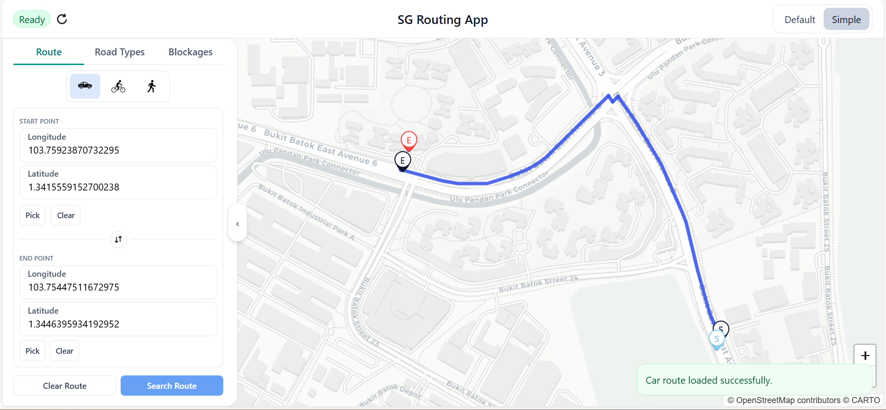
  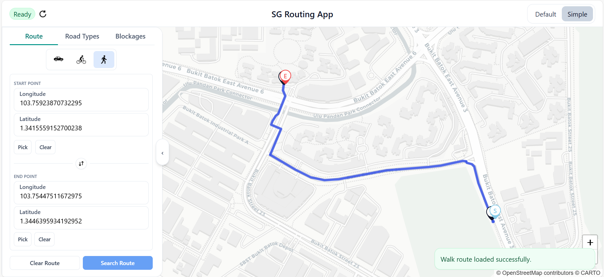
  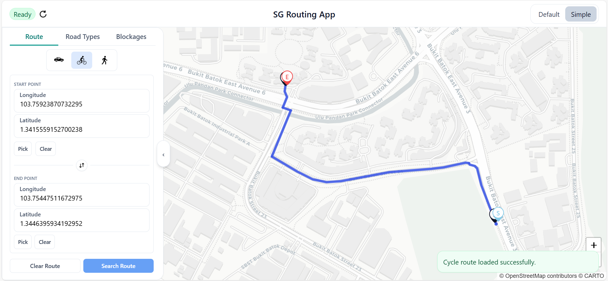

---

## Test for 10: View Road Types Overlay

**Objective:**
Verify that road-type layers can be toggled on/off and displayed on the map.

**Steps:**

1. Ensure a route is visible on the map.
2. Go to **Road Types** tab.
3. Toggle on one road type layer.
4. Toggle on a second road type layer.
5. Toggle the first layer off.

**Expected Results:**

* Selected road-type overlays appear as line layers on the map.
* Multiple overlays can be displayed together.
* Toggling overlays does not clear an existing route.

  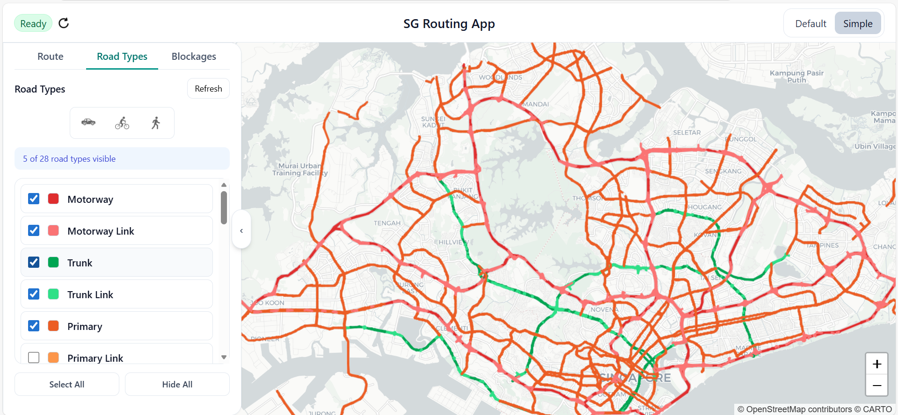

---

## Test for 11: Manage Blockages

**Objective:**
Verify blockages can be refreshed, added (typed + map-picked), deleted, and focused, and that reroute behaviour is triggered when appropriate.

**Steps:**

1. Go to **Blockages** tab and click **Refresh**.
2. Confirm existing blockages appear in the list and on the map.
3. Add a new blockage by typing valid lat/long, selecting a radius, entering a name, and clicking **Add**.
4. Add another blockage using **Pick** mode to set the point on the map, then click **Add**.
5. Delete a blockage from the list.
6. Click a blockage in the list to focus it on the map.

**Expected Results:**

* Refresh loads blockages into the list and map markers/circles appear.
* Adding a blockage creates it.
* Adding a blockage with the same name as an exisiting blockage displays an error.
* Adding a blockage with invalid coordinates displays an error.
* Deleting removes it from the list/map.
* Selecting a blockage focuses the map on it.
* As auto reroute is implemented, route recompute is triggered after blockage add/delete where applicable.

  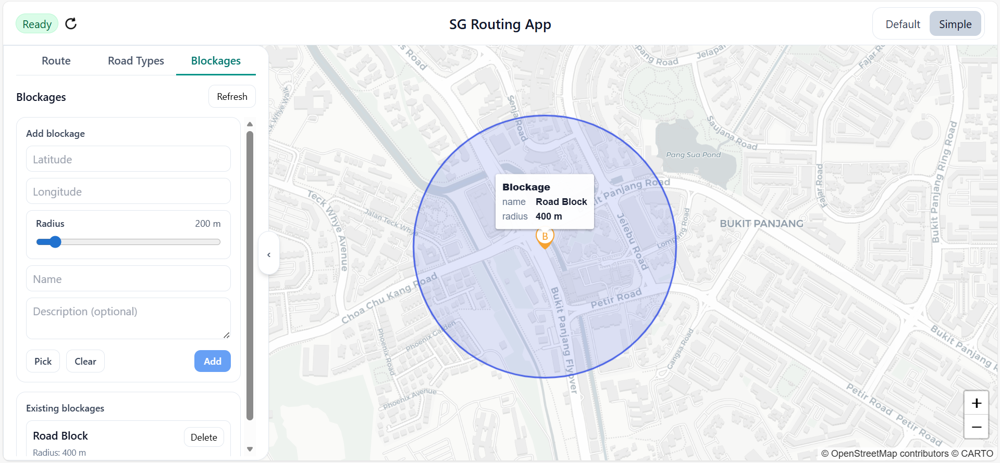

---

## Test for 12: Toggle Simple Map Style

**Objective:**
Verify that switching basemap style changes tiles without clearing route/overlays/blockages.

**Steps:**

1. Ensure a route is displayed and at least one overlay (road type or blockage) is visible.
2. Toggle the map style to **Simple**.
3. Observe the basemap.
4. Toggle back to **Default**.

**Expected Results:**

* Basemap tiles change to a simpler style when Simple is selected.
* Route and overlays remain visible and unchanged across toggles.

  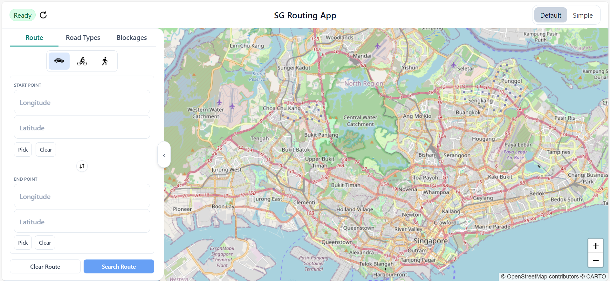
  

---

## Test for 13: Collapse / Expand Sidebar

**Objective:**
Verify the sidebar can collapse into a compact rail and reopen, remains usable for tab access, and does not break map interaction.

**Steps:**

1. With sidebar expanded, click the collapse control.
2. Confirm the sidebar becomes a compact rail.
3. Use the rail buttons to open:

   * Route tab
   * Road Types tab
   * Blockages tab
4. Click the open control to expand the sidebar again.
5. Perform a route search once with the sidebar expanded and once collapsed.

**Expected Results:**

* Sidebar collapses into a compact rail and expands back correctly.
* Rail buttons allow access to the main tabs.
* Map remains interactive in both states.
* Map focus behaviour still centres content correctly.

  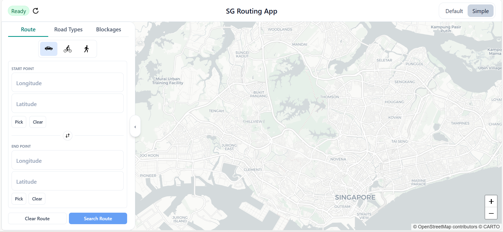
  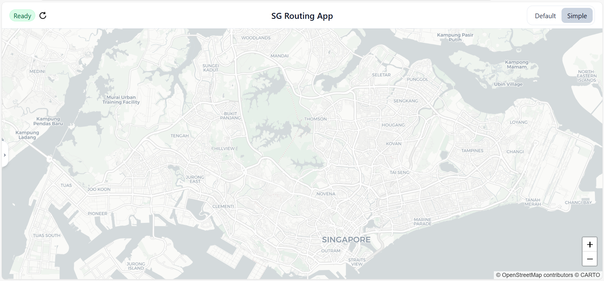

---
